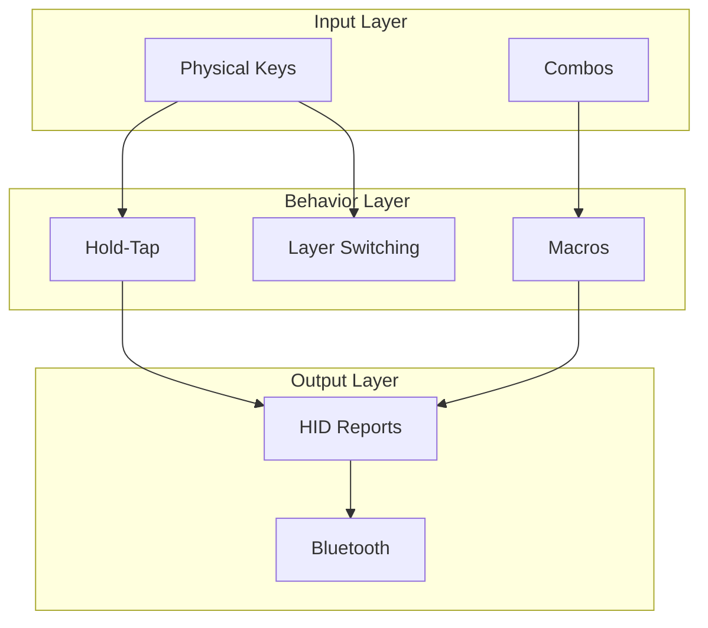

# [Feature Name] Design Document

## Overview

[Provide a brief description of the feature and its purpose. Explain how it fits into the keyboard firmware and what problem it solves.]

## Architecture

### Keymap Structure

```
Layer 0 (default) - Colemak-DH with homerow mods
Layer 1 (lower)   - Numbers and symbols
Layer 2 (raise)   - Function keys and navigation
Layer 3 (function) - Arrow keys, Bluetooth
Layer 4 (media)   - Mouse, media controls
```

### Component Interaction



## Components and Interfaces

### Behaviors

#### Custom Hold-Tap (homerow mods)
```dts
hm: homerow_mods {
    compatible = "zmk,behavior-hold-tap";
    #binding-cells = <2>;
    tapping-term-ms = <200>;
    quick-tap-ms = <0>;
    flavor = "tap-preferred";
    bindings = <&kp>, <&kp>;
};
```

#### New Behavior (if applicable)
```dts
[behavior_name]: [behavior_name] {
    compatible = "zmk,[behavior-type]";
    #binding-cells = <N>;
    // Configuration properties
};
```

### Macros

```dts
[macro_name]: [macro_name] {
    compatible = "zmk,behavior-macro";
    #binding-cells = <0>;
    bindings = <&macro_press &kp [KEY]>
             , <&macro_tap &kp [KEY]>
             , <&macro_release &kp [KEY]>;
};
```

### Layer Definition

```dts
[layer_name]_layer {
    bindings = <
//  ┌──────┬──────┬──────┬──────┬──────┬──────┐     ┌──────┬──────┬──────┬──────┬──────┬──────┐
//  │      │      │      │      │      │      │     │      │      │      │      │      │      │
//  ├──────┼──────┼──────┼──────┼──────┼──────┤     ├──────┼──────┼──────┼──────┼──────┼──────┤
//  │      │      │      │      │      │      │     │      │      │      │      │      │      │
//  ├──────┼──────┼──────┼──────┼──────┼──────┤     ├──────┼──────┼──────┼──────┼──────┼──────┤
//  │      │      │      │      │      │      │     │      │      │      │      │      │      │
//  └──────┴──────┴──────┼──────┼──────┼──────┤     ├──────┼──────┼──────┼──────┴──────┴──────┘
//                       │      │      │      │     │      │      │      │
//                       └──────┴──────┴──────┘     └──────┴──────┴──────┘
    [bindings here - 42 keys total]
    >;
};
```

## Configuration Changes

### corne.conf
```ini
# Feature toggles
CONFIG_[FEATURE]=y

# Parameter adjustments
CONFIG_[PARAMETER]=value
```

## Error Handling

### Build Errors
- **Syntax errors**: Validate devicetree syntax before building
- **Missing includes**: Ensure all required headers are included
- **Binding mismatches**: Verify binding-cells match behavior definitions

### Runtime Issues
- **Layer conflicts**: Document expected layer switching behavior
- **Timing issues**: Adjust tapping-term-ms if needed

## Testing Strategy

### Manual Testing
1. Flash firmware to both halves
2. Test all keys on affected layers
3. Verify homerow mods timing
4. Test Bluetooth connectivity
5. Verify layer switching works correctly

### Build Verification
```bash
nix build              # Local build
nix flake check        # Validate configuration
```

## Platform-Specific Considerations

### Split Keyboard
- Both halves must be flashed with updated firmware
- Central (left) handles Bluetooth connections
- Peripheral (right) communicates via Bluetooth to central

### nice_nano_v2
- nRF52840 based
- Bluetooth 5.0
- USB-C for flashing and charging

## Assumptions and Dependencies

### ZMK Dependencies
- ZMK version specified in `config/west.yml`
- Zephyr RTOS compatibility

### Hardware Requirements
- nice_nano_v2 controllers
- Corne PCB
- Functioning Bluetooth

---

**Requirements Traceability**: This design addresses requirements [list requirement IDs from requirements.md]

**Review Status**: [Draft/In Review/Approved]

**Last Updated**: [Date]
