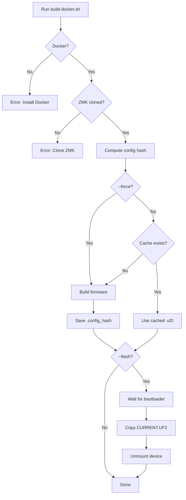

# Docker Local Build Design Document

## Overview

This feature adds a Docker-based local build workflow as an alternative to the existing Nix build system. The primary motivation is that the Nix build via `zmk-nix` has compatibility issues with OLED display support, while Docker-based builds use the same environment as GitHub Actions, ensuring full feature parity.

## Architecture

### Directory Structure

```
sinh-zmk-config/
├── scripts/
│   └── build-docker.sh      # Main build script
├── config/
│   ├── corne.keymap         # Keymap definition
│   └── corne.conf           # Configuration
├── output/                   # Generated build artifacts
│   └── YYYYMMDD-HHMM/       # Timestamped build folder
│       ├── corne_left.uf2
│       ├── corne_right.uf2
│       └── .config_hash     # SHA256 hash for caching
└── .gitignore               # Ignores output/

External:
~/git-repos/others/zmk/      # ZMK source (user-cloned)
```

### Build Flow



## Key Components

### 1. Build System

| Component | Value |
|-----------|-------|
| Docker Image | `zmkfirmware/zmk-build-arm:stable` |
| Board | `nice_nano` (revision system, defaults to v2.0.0) |
| Shields | `corne_left`, `corne_right` |
| Build Tool | West (Zephyr meta-tool) |
| Output | UF2 bootloader files |

### 2. Build Caching

- Computes SHA256 hash of all files in `config/` directory
- Stores hash in `output/<timestamp>/.config_hash`
- On subsequent runs, checks newest builds first for matching hash
- Use `--force` to bypass cache

### 3. Flash System

**Detection Strategy** (in order):

| Priority | Method |
|----------|--------|
| 1 | Check common mount points with `mountpoint -q` verification |
| 2 | Search `mount` output for NICENANO |
| 3 | Check for NANO/NRF variant names |
| 4 | **Manual selection** - after 5 seconds, show `lsblk` and prompt user |

**Flash Process**:
1. Mount device (auto or manual selection)
2. Copy firmware as `CURRENT.UF2`
3. `sync` to ensure write completes
4. Unmount device
5. Clean up mount point directory

## Configuration

### Environment Variables

| Variable | Default | Description |
|----------|---------|-------------|
| `ZMK_DIR` | `~/git-repos/others/zmk` | Path to ZMK repository |

### Script Options

| Option | Description |
|--------|-------------|
| `-l, --left-only` | Build only left half |
| `-r, --right-only` | Build only right half |
| `-f, --flash` | Flash both halves after build |
| `--flash-left` | Flash only left half |
| `--flash-right` | Flash only right half |
| `--force` | Force rebuild (skip cache) |
| `-c, --clean` | Clean output directory |
| `-h, --help` | Show help |

## Error Handling

| Exit Code | Condition |
|-----------|-----------|
| 0 | Success |
| 1 | Docker not available |
| 2 | ZMK directory not found |
| 3 | Build failed |

## Verification Checklists

### Build
- [x] Script runs without errors
- [x] Left/right .uf2 files generated
- [x] Firmware boots on keyboard
- [x] OLED display works

### Caching
- [x] Hash computed and stored
- [x] Cached builds detected
- [x] `--force` bypasses cache

### Flash
- [x] Bootloader detection works
- [x] Manual device selection works
- [x] Firmware copied as CURRENT.UF2
- [x] Device unmounted after copy

---

**Status**: Implemented | **Version**: 2.0 | **Updated**: 2026-01-15
